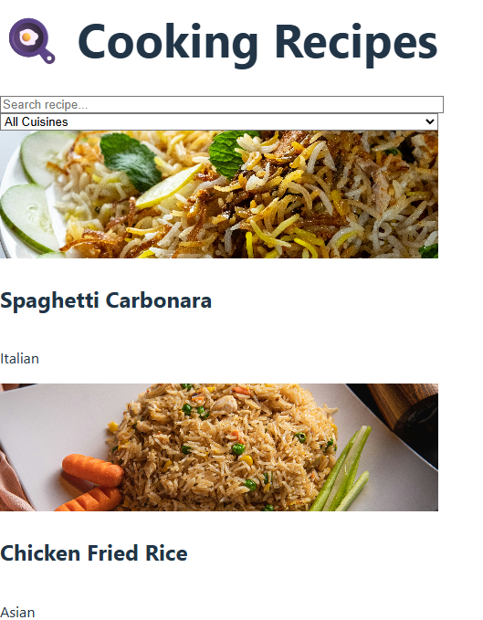

# Recipe App 🍳

Một ứng dụng web nấu ăn đơn giản, đầy đủ chức năng, được xây dựng bằng **React** và **Vite** cùng **Tailwind CSS**.

## Tính năng
- Hiển thị danh sách các món ăn với **ảnh**, **tên món** và **loại ẩm thực**
- Giao diện **responsive** trên desktop
- Click vào card để xem chi tiết món ăn 

## Công nghệ sử dụng
- React + Vite
- Tailwind CSS
- JavaScript

## Hình ảnh demo
![Ảnh demo ứng dụng]

## Repository GitHub
Code frontend: https://github.com/conlonsua335-oss/recipe-app

## Website trực tuyến
Xem ứng dụng live: https://recipe-app-phi-lake.vercel.app/

## Cài đặt và chạy local
```bash
# Clone repo về máy
git clone https://github.com/conlonsua335-oss/recipe-app

# Vào thư mục project
cd recipe-app

# Cài đặt dependencies
npm install

# Chạy project local
npm run dev

